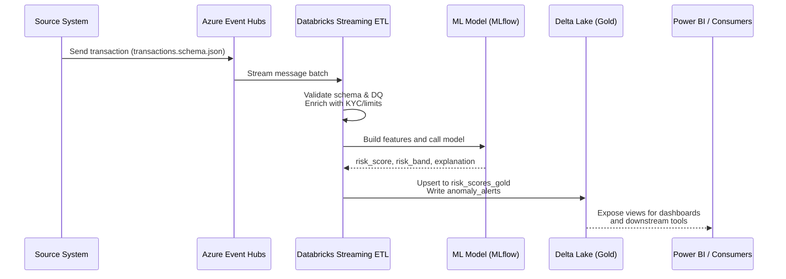

# Compliance & Anomaly Detection – Big-4 Audit & Consulting Firm (Azure + Databricks)

> Sanitized, docs-only case study. Patterns only; no client code or client data.


## Quick Facts

- **Use case:** Compliance & anomaly detection for financial transactions and audit logs for a Big-4 audit & consulting firm.
- **Pipelines:** Streaming Pipeline (ETL) for near real-time scoring + Batch Pipeline (ELT) for reconciliations and regulatory snapshots.
- **Cloud:** Azure – Event Hubs, Data Factory, Azure Databricks, Delta Lake, Azure SQL / Synapse, Azure Data Lake Storage (ADLS), Key Vault, Purview.
- **ML:** Databricks MLflow models scoring risk for each transaction; outputs written to Delta Lake and consumed by Power BI.
- **Input rate (simulated):**
  - Peak: ~1,200 transactions/second.
  - Daily: ~80 million transaction events/day.
- **Key tables:** `transactions_bronze`, `transactions_silver`, `risk_scores_gold`, `anomaly_alerts`, `dq_results`, `regulatory_snapshots`.
- **SLOs (simulated):**
  - p95 end-to-end Streaming Pipeline (ETL) latency: **< 60 seconds** from event to risk score.
  - Batch Pipeline (ELT) reconciliation completion by **T+1 06:00 UTC**.
  - Data Quality pass rate ≥ **95%** on critical rules.

---

## 1. What this project is about

This repo documents a **Compliance & Anomaly Detection** data platform built on **Azure + Databricks** for a Big-4 audit & consulting firm.

The platform ingests high-volume financial transactions and compliance events, scores them for anomalies using **Databricks ML pipelines**, and exposes risk scores and alerts to:

- Internal **compliance officers**,
- **Audit teams** performing surveillance and investigations,
- Downstream regulatory and reporting systems.

Everything here is **sanitized and synthetic**. The goal is to showcase **Streaming Pipeline (ETL)**, **Batch Pipeline (ELT)**, and **ML pipeline integration**, not business secrets.

### 1.1 Inputs

**Streaming inputs (transactions):**

- Transactions and compliance events from source systems.
- Landed into **Azure Event Hubs** as JSON messages that follow `contracts/transactions.schema.json`.
- Example fields: `transaction_id`, `event_time`, `account_id`, `amount`, `currency`, `channel`, `country`, `mcc_code`, `risk_flags`.

**Batch inputs (reference & lookup data):**

- KYC and customer profiles.
- Limits & thresholds, watchlists, blacklists.
- FX and reference rates.
- Delivered as files into **Azure Data Lake Storage (ADLS)** and loaded via **Azure Data Factory (ADF)** into Delta Lake.

### 1.2 Outputs

- **Risk scores for every transaction**:
  - Written as `risk_scores` events conforming to `contracts/risk_scores.schema.json`.
  - Persisted to `risk_scores_gold` Delta table with model version, pipeline run ID, and DQ status.
- **Anomaly alerts:** high-risk events persisted to `anomaly_alerts` plus notifications to downstream case-management systems (conceptual).
- **Regulatory & audit snapshots:** daily and monthly snapshots in `regulatory_snapshots` tables for audit-ready storage.
- **Operational evidence:** DQ results (`dq_results`), pipeline run metadata, and ML model lineage for each scoring run.

### 1.3 Business logic (high level)

1. Validate every incoming transaction against schema and core DQ rules.
2. Enrich with KYC, limits, historical behaviour features, and country/channel profiles.
3. Build a feature vector and call the **ML anomaly detection model** in Databricks.
4. Generate a `risk_score` between 0 and 1, plus `risk_band` (LOW, MEDIUM, HIGH) and top feature contributions.
5. Persist results and anomalies to Delta Lake, and surface them to Power BI and downstream tools.
6. Use **Batch ELT pipelines** to reconcile streaming outputs against system-of-record data and create regulatory snapshots.

---

## 2. Streaming Pipeline (ETL)

**Flow (near real-time):**

**Event Hubs → Databricks Structured Streaming (PySpark) → Delta Lake (Bronze → Silver → Gold) → Power BI / APIs**

Key stages:

1. **Ingest**  
   - Read JSON events from Azure Event Hubs into a Databricks Structured Streaming job.  
   - Persist raw payload to `transactions_bronze` with minimal transformation.

2. **Validate & cleanse**  
   - Enforce the JSON schema from `transactions.schema.json`.  
   - Run DQ rules: required fields, type checks, amount ranges, supported currencies, valid countries, referential checks to KYC and watchlists.  
   - Route invalid records to a **DLQ bronze table** with reason codes.

3. **Enrich & transform**  
   - Join with reference tables (KYC, limits, watchlists).  
   - Compute behaviour features (velocity, recent count, geolocation distance, merchant risk scores).  
   - Write enriched results to `transactions_silver` with partitioning (e.g., by event_date, region).

4. **Score with ML (ETL step)**  
   - Load the current production model from **MLflow Model Registry**.  
   - Build feature vector and call the model for each transaction.  
   - Generate:
     - `risk_score` in [0, 1],
     - `risk_band` (LOW / MEDIUM / HIGH),
     - explanation list (top contributing features).  
   - Add `model_version`, `model_run_id`, `pipeline_run_id`, and latency metrics.

5. **Persist & serve**  
   - Upsert into `risk_scores_gold` (using transaction_id + event_time as a composite key).  
   - Create `anomaly_alerts` table for HIGH band scores and key attributes.  
   - Expose Delta tables to Power BI via Azure SQL / Synapse views.

---

## 3. Batch Pipeline (ELT)

**Flow (daily / intraday):**

**ADF → Databricks Batch Jobs → Delta Lake → Azure SQL / Synapse → Power BI**

Responsibilities:

1. **Reconciliation ELT**  
   - Load daily system-of-record transaction files into staging tables.  
   - Compare counts and key metrics against streaming `transactions_silver` and `risk_scores_gold`.  
   - Generate reconciliation reports (leakage, duplicates, late arrivals).

2. **Compaction & optimization**  
   - Periodically compact small Delta files into optimized partitions.  
   - Repartition by date / region / risk_band for analytics workloads.

3. **Regulatory snapshots**  
   - Produce daily and monthly snapshots of risk scores and anomaly decisions.  
   - Store them in `regulatory_snapshots` with immutable partitions and hash totals for audit.

4. **Backfill & replay**  
   - Provide orchestrated flows to reprocess a date range from `transactions_bronze` when:  
     - Model logic changes, or  
     - New DQ rules are introduced.  
   - All steps are orchestrated by **Cloud ADF pipelines** and **Databricks jobs**.

---

## 4. ML Pipeline (training + deployment)

The **ML pipeline** consists of a **Batch Pipeline (ELT)** for training and a **Streaming Pipeline (ETL)** for serving in production.

### 4.1 Feature engineering & training (Batch ELT)

- Pull features from `transactions_silver` and historical feature tables.  
- Generate label dataset using past investigations and confirmed alerts (synthetic in this repo).  
- Store training dataset in `ml_features_training` Delta table.  
- Train candidate models in Databricks notebooks / jobs, track everything with **MLflow** (parameters, metrics, artefacts).

### 4.2 Model governance

- Register trained models in **MLflow Model Registry**.  
- Use stages: `Staging`, `Production`, `Archived`.  
- Require human approval / review before promoting to `Production`.  
- Capture links to training code, dataset version, and feature schema.

### 4.3 Serving & monitoring (Streaming ETL)

- Streaming jobs read the **Production** model from the registry at start-up.  
- Log scoring metrics and latency per micro-batch.  
- Monitor for drift (feature distribution, rejection rate, band distribution).  
- Send metrics to Azure Monitor / Log Analytics with alerts on SLO breaches.

---

## 5. Architecture diagram (L2)

```mermaid
flowchart LR
    subgraph Sources
        A[Transaction Systems]
        B[Compliance Logs]
        C[Reference Files<br/>KYC, Limits, Watchlists]
    end

    A --> EH[Azure Event Hubs]
    B --> EH

    C --> ADF[Azure Data Factory<br/>Batch Ingest]

    EH --> SS[Databricks Streaming Job<br/>Streaming Pipeline (ETL)]
    ADF --> BJ[Databricks Batch Jobs<br/>Batch Pipeline (ELT)]

    SS --> BR[Delta Lake - Bronze]
    BR --> SV[Delta Lake - Silver]
    SV --> GD[Delta Lake - Gold<br/>risk_scores, alerts]

    BJ --> SV
    BJ --> SNAP[Regulatory Snapshots]

    SV --> FEAT[ML Feature Tables]
    FEAT --> TRAIN[Databricks ML Training<br/>MLflow Experiments]
    TRAIN --> REG[MLflow Model Registry]
    REG --> SS

    GD --> SQL[Azure SQL / Synapse Views]
    SQL --> PBI[Power BI Dashboards]

    subgraph Governance
        PUR[Purview Lineage]
        KV[Key Vault CMK]
    end

    BR --> PUR
    SV --> PUR
    GD --> PUR
    ADF --> PUR
    KV -. CMK .- BR
    KV -. CMK .- SV
    KV -. CMK .- GD
```

---

## 6. Event life-cycle / Dataflow diagram



---

## 7. Repository structure

```text
big4-audit-compliance-anomaly-detection-azure-databricks/
├─ README.md
├─ RUNBOOK.md
├─ SECURITY.md
├─ ETHICS.md
├─ LICENSE
├─ CODEOWNERS
├─ CODE_OF_CONDUCT.md
├─ CONTRIBUTING.md
├─ .pre-commit-config.yaml
├─ .markdownlint.jsonc
├─ .markdownlint-cli2.jsonc
├─ .editorconfig
├─ contracts/
│  ├─ transactions.schema.json
│  └─ risk_scores.schema.json
├─ adr/
│  └─ 0001-architecture-decision.md
└─ docs/
   ├─ 01-overview.md
   ├─ 02-architecture-overview.md
   ├─ 03-pipeline-spec-streaming.md
   ├─ 04-pipeline-spec-batch.md
   ├─ 05-data-models.md
   ├─ 06-ml-pipeline-and-model-governance.md
   ├─ 07-data-quality-and-monitoring.md
   ├─ 08-security-and-compliance.md
   ├─ 09-lineage-and-audit.md
   ├─ 10-operations-and-runbooks.md
   ├─ 11-cost-and-slos.md
   └─ 12-roadmap.md
```

For detailed explanations, see the files under `docs/` and the operational procedures in `RUNBOOK.md`.
